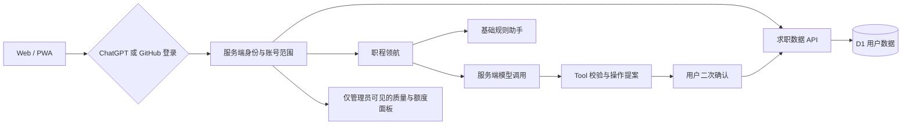

<p align="center">
  
</p>

<h1 align="center">职序 / CAREER RHYTHM</h1>

<p align="center">
  把分散的公司、岗位、时间与判断，整理成一条可行动的职业路径。
</p>

<p align="center">
  <a href="https://job-application-desk-lcy.plupluto.chatgpt.site/">在线体验</a>
  ·
  <a href="#核心功能">核心功能</a>
  ·
  <a href="#从-0-到当前阶段">产品演进</a>
  ·
  <a href="#隐私与安全边界">隐私说明</a>
</p>

## 产品概览

职序是一款面向个人求职者的多用户联网求职进程管理产品。它以“公司 → 岗位 → 招聘流程”为核心信息结构，把散落在不同招聘官网、备忘录和聊天记录中的投递信息集中管理，并通过可安装的 PWA 在手机与电脑之间同步。

产品同时提供“职程领航 · 智能助手”：基础助手使用本地规则整理逾期、近期安排、长期未推进和信息缺失；智能模式通过服务端受控 Tool 查询或生成操作提案。任何新增、修改或删除都不会由模型直接执行，必须由用户查看预览并再次确认。

- **当前阶段**：多用户联网公开测试版
- **主要用户**：希望持续跟踪多家公司、多岗位求职进度的个人求职者
- **核心价值**：集中记录、跨设备查看、明确下一步、降低遗漏、让智能建议保持可控
- **在线地址**：[https://job-application-desk-lcy.plupluto.chatgpt.site/](https://job-application-desk-lcy.plupluto.chatgpt.site/)

## 问题与需求洞察

### 用户问题

1. 不同公司使用不同招聘系统，投递记录和流程状态分散。
2. 同一公司可能同时投递多个岗位，仅记录公司名称无法区分真实进展。
3. 投递日期、面试安排和下一步行动容易被聊天消息或日历信息淹没。
4. 手机适合随时查看，电脑适合集中整理，但本地文件很难自然同步。
5. 通用聊天机器人可以给建议，却不应该直接操作个人求职数据。

### 产品目标

- 建立清晰、可维护的公司—岗位—流程层级。
- 让求职者在首页快速识别正在推进、进入面试、收到 Offer 和全部岗位。
- 同一登录身份可以在手机和电脑查看同一份云端数据。
- 在保留基础规则能力的同时，引入可关闭、可限额、可确认的智能能力。
- 让数据隔离、密钥保护和删除个人数据成为产品默认能力，而不是上线后的补丁。

### 当前不做的事情

- 不代替用户登录第三方招聘网站，不抓取账号密码。
- 不自动投递简历，不代表用户向公司发送信息。
- 不让模型直接访问数据库或绕过确认执行写操作。
- 不把相同邮箱的 ChatGPT 与 GitHub 身份自动合并。

## 核心用户流程

```text
登录
  → 添加或进入目标公司
  → 在公司下添加一个或多个岗位
  → 记录投递日期、当前阶段与下一步安排
  → 追加笔试 / 面试 / Offer 等流程记录
  → 从首页、搜索、筛选或智能简报持续推进
  → 导出备份，或在需要时删除个人云端数据
```

## 核心功能

### 1. 职业机会工作台

- 展示“进行中的岗位、面试阶段、收到 Offer、全部岗位”四类概览。
- 点击指标卡可展开对应岗位明细，而不是只显示数量。
- 聚合目标公司数量、优先级、下一步安排和近期流程。
- 支持按公司、岗位或地点搜索，并按招聘阶段筛选。

### 2. 公司、岗位与招聘流程

- 公司增删改查，可保存名称、简称、标记颜色、招聘官网和备注，并在新标签页打开官网。
- 每家公司下可单独添加岗位，也可批量添加多个岗位。
- 单次批量添加最多 20 个岗位，并检查必填项、日期格式及已有或批次内重复记录。
- 岗位字段包括名称、地点、招聘类型、岗位链接、投递日期、优先级、当前阶段、下一步行动、下一步日期和备注。
- 招聘流程支持添加、编辑和删除时间线记录。
- 当前阶段覆盖：意向岗位、已投递、测评/笔试、一面、后续面试、Offer、进入人才库、被拒和已结束。
- 投递日期采用分段输入与自动跳转；“今天、明天”等相对日期按请求者设备的当地时区解析。

### 3. 多用户登录与云端同步

- 支持 ChatGPT 登录和 GitHub OAuth 登录。
- 登录只负责确认身份；求职数据按服务端稳定账号 ID 隔离。
- ChatGPT 与 GitHub 即使使用相同邮箱，也会被视为两个独立身份。
- 每个账号拥有独立的公司、岗位、流程、配额和本机缓存空间。
- 同一登录方式可在手机和电脑查看同一份云端数据。
- 云端写入使用数据版本校验，旧数据不会静默覆盖新数据。

### 4. PWA 与移动端体验

- 可在支持的手机和桌面浏览器中“添加到主屏幕/安装应用”。
- 支持安全区域、独立窗口、离线静态资源缓存和响应式布局。
- 手机端避免输入框自动放大、文字截断和横向溢出。
- 侧栏与弹窗打开时锁定背景滚动，并在关闭后恢复原位置。
- 桌面端使用精致弹窗，手机端智能助手使用全屏页面。

PWA 会缓存应用所需的静态资源和当前账号的隔离副本，但登录、云端同步与智能分析仍需要网络；本项目不将其描述为完全离线应用。

### 5. 备份与个人数据管理

- 导出当前账号的 JSON 备份。
- 导入前展示将替换的数据范围，并支持粘贴备份内容。
- 本机缓存按账号隔离；退出登录时清除当前账号的本机缓存，不删除云端数据。
- “删除我的数据”使用两步确认；最终确认前不会删除任何内容。
- 删除范围只限当前已认证账号，不能影响其他用户。
- 新账号可以从空白开始，也可以导入完全虚构的示例公司了解产品结构。

## 职程领航 · 智能助手

<p>
  
</p>

### 两种工作模式

| 模式 | 作用 | 是否调用模型 |
| --- | --- | --- |
| 基础助手 | 根据投递日期、下一步日期和完整度生成规则化简报 | 否 |
| 智能分析 | 理解自然语言问题，查询数据、解释情况、生成建议或受控操作提案 | 是 |

当智能调用关闭、额度用完、网络超时或服务异常时，系统会给出人性化提示并自动保留基础助手；公司、岗位和流程管理不受影响。

### 受控 Tool 设计

智能助手当前支持当前账号范围内的：

- 查询公司和岗位；
- 新增公司、新增岗位；
- 修改公司、修改岗位；
- 删除公司、删除岗位。

涉及写入时采用统一流程：

```text
用户自然语言请求
  → 模型选择受控 Tool
  → 服务端校验身份、结构、枚举、重复项和候选数量
  → 生成操作预览，不写入数据
  → 用户二次确认
  → 服务端再次校验版本、确认凭证和幂等键
  → 数据库真实成功后才显示完成
```

- 公司不存在时，可生成“创建公司并新增岗位”的组合预览。
- 缺失字段显示“未填写”，不会由模型猜测。
- 零匹配或多匹配时先澄清，不擅自选择目标。
- 删除操作使用独立的红色风险确认区。
- 重复点击、过期提案、版本冲突或错误确认凭证不会重复执行。
- 模型无数据库凭据，也没有确认操作的权限。
- 用户可以评价“已解决 / 还需继续”及“操作正确 / 操作有误”，用于形成匿名质量指标。

## 管理面板与质量评估

仅初始管理员可以进入智能助手管理面板。管理能力包括：

- 全局开启或紧急关闭智能调用；
- 修改普通账号的滚动 24 小时默认额度；
- 为单个账号设置独立额度或恢复全体默认；
- 单独停用或恢复某个账号的智能调用；
- 查看匿名用户编号、角色、已用次数、最后调用时间和 Token；
- 查看不包含岗位正文和对话正文的质量与安全指标。

### 在线指标口径

| 维度 | 当前指标示例 |
| --- | --- |
| 结果 | 用户确认任务解决率、一轮解决率、反馈覆盖率 |
| 稳定性 | 技术成功率、平均响应时长、95 分位响应时长 |
| Tool 质量 | 参数校验通过率、真实执行成功率、多候选安全澄清率 |
| 安全 | 用户确认误操作率、未经确认执行次数、重复新增拦截、版本冲突率 |
| 效率 | 完成任务平均轮数、累计 Token |

这些在线指标来自真实运行元数据和用户主动反馈，适合持续观察产品表现，但不冒充人工金标评测。意图准确率、Tool 选择准确率和参数完全匹配率需要版本化离线评测集，列入后续评估计划。

## 多用户与 Agent 架构



关键边界：

- 浏览器提交的邮箱或 `userId` 不被当作权限依据；账号范围由服务端认证结果决定。
- API Key、OAuth Secret 和管理员稳定 ID 只保存在部署端 Secret 中。
- 用户数据、Agent 配额、操作提案和管理权限都绑定当前服务端账号。
- 当前采用单 Agent、单提案、单执行器，优先保证可解释和写入确定性。

## 隐私与安全边界

- 本仓库不包含线上用户数据、备份文件、部署密钥或真实管理员 ID。
- 豆包 API Key 和 GitHub OAuth Secret 不写入源码，也不会发送到浏览器。
- 模型只接收回答当前请求所需的最小结构化上下文，不接收岗位备注正文。
- 完整问题和回答不写入管理日志；仅保留调用状态、Token、耗时及匿名评估事件。
- GitHub 登录使用 PKCE，不申请仓库权限；OAuth Provider Token 使用后即丢弃，会话只保存不可逆哈希。
- 所有数据查询和写入都限定在当前认证账号范围内。
- 用户可以导出备份、退出登录清除本机缓存，也可以通过两步确认删除个人云端数据。

请勿在 Issue、截图、提交或测试数据中公开 API Key、OAuth Secret、管理员 ID、真实简历、联系人信息、面试内容或个人备份。

## 关键产品决策

| 决策 | 选择 | 原因 |
| --- | --- | --- |
| 信息架构 | 公司 → 岗位 → 招聘流程 | 符合求职者实际判断层级，避免同公司多岗位混淆 |
| 身份隔离 | 使用 Provider 的稳定账号 ID | 邮箱可能变化或在多个 Provider 重复，不能作为可靠权限边界 |
| 智能降级 | 基础助手与智能分析并存 | 模型关闭或失败时，核心产品仍然完整可用 |
| Agent 写入 | 先提案、再确认、后执行 | 让用户始终掌握最终决定，避免模型把建议误当成操作 |
| 当前 Agent 形态 | 单 Agent + 受控 Tool | 对现阶段 CRUD 更快、更省 Token，也更容易保证确定性 |
| 日期理解 | 使用请求者当地时区 | “今天/明天”应反映用户所在地，而不是服务器固定时区 |
| 评估策略 | 在线行为指标 + 后续离线金标 | 区分用户反馈代理指标与客观准确率，避免指标命名失真 |

## 从 0 到当前阶段

### 阶段 0：问题定义与产品边界（2026 年 8 月下旬）

- 从“在一个页面查看不同公司招聘网站和投递进度”的个人需求出发。
- 确定公司、岗位、流程三层结构和完整 CRUD。
- 明确系统只管理记录，不代替用户登录招聘网站或自动投递。

### 阶段 1：本地 MVP

- 完成公司、岗位、流程、搜索、筛选、统计、招聘链接和 JSON 备份。
- 使用浏览器本地存储，验证核心信息结构和日常使用路径。
- 优化日期输入为固定分隔与自动跳转，并补充“进入人才库、被拒”等流程阶段。

### 阶段 2：视觉与交互系统

- 建立“职序 / CAREER RHYTHM”品牌、字体层级、绿色主色和卡片组件语言。
- 针对手机侧栏、弹窗滚动、键盘焦点、页面位置、触控目标和删除确认完成交互体检。
- 将首页指标卡改为可点击明细，让数量与具体岗位形成闭环。

### 阶段 3：PWA 与私人云端版

- 增加可安装 PWA、移动端安全区域和静态资源缓存。
- 从单设备本地数据升级为登录后的云端同步，并保留按账号隔离的本机缓存和备份能力。
- 加入退出清缓存、导出备份、导入提示和删除个人数据流程。

### 阶段 4：多用户身份与数据隔离

- 支持 ChatGPT 与 GitHub 两种登录入口。
- 使用稳定 Provider 账号 ID 隔离数据，不按邮箱自动合并身份。
- 为云端状态加入版本校验，防止多设备旧数据静默覆盖。

### 阶段 5：职程领航与受控 Agent

- 从规则化“今日简报”演进到可选的豆包智能分析。
- 增加查询、新增、修改、删除 Tool，并统一为“操作提案 → 用户确认 → 真实执行”。
- 加入普通用户额度、失败不扣次数、基础助手降级、全局紧急关闭和单用户停用。
- 建立匿名 Token、时延、任务反馈、Tool 校验和安全事件指标。

### 阶段 6：当前公开测试阶段

- 发布多用户联网版和公开源码仓库。
- 修复相对日期的请求者当地时区解析。
- 为“职程领航 · 智能助手”加入独立专业标识，同时保持主品牌和原有页面视觉不变。
- 完成公开隐私扫描、产品文档重构和当前能力边界说明。

## 当前阶段与演进方向

当前版本定位为个人及小范围多用户公开测试。数据正确性方面已经通过账号隔离、数据版本、额度预占、提案确认和幂等执行保护并发写入；正式面向更大规模流量前，仍将通过部署环境压测建立可验证的容量基线，并补充峰值排队、模型并发保护与管理指标预聚合。

同一账号在手机和电脑同时编辑时，旧版本不会覆盖新版本，但冲突后的自动合并体验仍可继续优化。后续会优先提供更清晰的冲突对比、恢复与重试流程。

智能助手当前有意保持“单 Agent + 受控 Tool”。未来多 Agent 将优先用于简历匹配、岗位比较、JD 分析和面试准备等可并行的只读任务；涉及求职数据写入时，仍坚持“单一提案、用户确认、单一执行器”。

公开测试阶段允许已支持的 ChatGPT 或 GitHub 账号登录；邀请名单与审批制尚未启用，列入后续访问管理路线图。

## 产品路线图

### 近期

- 建立真实部署环境的并发与容量测试基线。
- 增加模型调用排队、峰值保护、有界重试和基础助手降级观测。
- 优化同账号多设备冲突后的对比、恢复和重试体验。
- 对管理指标进行时间窗口与预聚合，确定匿名运行元数据保留期。
- 建立意图、Tool 选择和参数准确率的版本化离线金标评测集。

### 后续

- 增加邀请名单或管理员审批访问模式。
- 在复杂只读场景中验证受控多 Agent，而不是让多个 Agent 竞争写数据。
- 评估更细粒度的数据模型，降低无关岗位之间的版本冲突。
- 增加可撤销操作与更完整的变更历史。

## 产品迭代日志

从 2026-09-01 起，发布记录尽量保留“日期、时间、时区、改进与验证”。历史记录没有可靠时间时只写日期，不补造分钟。

以下时间均为当时墨尔本时间 AEST（UTC+10），来自已保存的 Git 提交记录。

| 日期时间 | 产品改进 |
| --- | --- |
| 2026-08-27 14:38 | 完成私人云端求职记录 MVP |
| 2026-08-27 14:52 | 增加适合移动端的粘贴备份恢复方式 |
| 2026-08-27 15:23 | 支持安装到 iPhone 主屏幕的 PWA |
| 2026-08-27 15:36 | 建立“职序 / CAREER RHYTHM”品牌与分段日期交互 |
| 2026-08-27 15:44 | 指标卡支持展开具体岗位明细 |
| 2026-08-27 15:59 | 进入多用户公开测试准备阶段 |
| 2026-08-27 16:12 | 优化手机信息层级与个人数据两步确认 |
| 2026-08-27 16:17 | 修正登录入口表达，避免身份验证方式产生误解 |
| 2026-08-27 16:50 | 完成侧栏、弹窗、焦点、滚动和移动端触控体验优化 |
| 2026-08-27 17:13 | 优化云端连接与加载反馈 |
| 2026-08-30 17:05 | 完善新增流程、批量岗位与云端版本保护 |
| 2026-08-31 00:06 | 上线职程领航规则助手和行动建议 |
| 2026-08-31 00:12 | 在多用户开放前建立单账号安全检查点 |
| 2026-08-31 00:55 | 完成服务端多用户隔离并优化手机体验 |
| 2026-08-31 02:59 | 恢复并固定职序品牌视觉系统 |
| 2026-09-01 04:11 | 加入受控 Agent 操作提案与管理后台 |
| 2026-09-01 12:38 | 扩展公司/岗位受控增删改查并优化后台读取 |
| 2026-09-01 12:48 | 发布多用户联网版，完成自动测试、Lint 与生产构建 |
| 2026-09-01 13:15 | 将“今天/明天”等相对日期改为按请求者当地时区解析 |
| 2026-09-01 14:27 | 更新职程领航独立 Logo；重构公开产品文档；补充隐私、并发阶段与路线图；将生产与开发依赖升级至安全审计无告警版本 |

## 技术选型

| 层级 | 当前实现 |
| --- | --- |
| 前端 | Next.js 16、React 19、TypeScript、响应式 PWA |
| 构建与运行 | Vinext、Vite、Cloudflare Workers 兼容输出 |
| 数据 | Cloudflare D1、账号范围校验、乐观版本控制 |
| 身份 | ChatGPT 身份认证、GitHub OAuth 2.0 + PKCE |
| 智能能力 | 火山方舟豆包、服务端受控 Tool、基础规则助手降级 |
| 质量 | Node Test Runner、SQLite 行为测试、ESLint、生产构建、npm 依赖安全审计 |

## 本地开发

### 环境

- Node.js 22.13 或更高版本
- npm

```bash
npm install
npm run dev
```

### 验证

```bash
npm test
npm run lint
npm run build
```

当前 84 项自动化测试覆盖用户范围、云端状态、GitHub 登录、Agent 调用、额度并发、受控 CRUD、二次确认、重复执行保护、版本冲突、管理指标与相对日期等关键路径。

### 联网能力配置

完整联网功能需要 D1 数据库，并在部署端配置以下服务端变量。变量名称可以公开，实际值不得进入 Git：

| 变量 | 用途 | 边界 |
| --- | --- | --- |
| `ARK_API_KEY` | 火山方舟通用 API Key | 仅部署端 Secret |
| `ARK_MODEL_ID` | 豆包模型完整 ID | 服务端变量 |
| `ADMIN_CHATGPT_USER_ID` | 唯一初始管理员稳定 ID | 私密服务端变量 |
| `GITHUB_CLIENT_ID` | GitHub OAuth App Client ID | 服务端变量 |
| `GITHUB_CLIENT_SECRET` | GitHub OAuth App Secret | 仅部署端 Secret |
| `PUBLIC_APP_ORIGIN` | 正式网站 Origin | 服务端变量 |

数据库迁移位于 `drizzle/`。完整配置、验收和密钥轮换流程见 [部署说明-智能助手与GitHub登录.md](./部署说明-智能助手与GitHub登录.md)。普通使用方式见 [使用说明.md](./使用说明.md)。

## 项目结构

```text
app/page.tsx                 主要产品界面与交互
app/api/                     云端状态、登录、Agent 与管理接口
app/lib/                     账号范围、业务规则、Tool、额度和指标逻辑
db/schema.ts                 D1 结构与兼容检查
drizzle/                     数据库迁移
public/                      PWA 图标、品牌资源与 Service Worker
```

## 公开仓库边界

本仓库公开用于产品作品展示、技术交流和代码审阅。公开源码不等于公开线上用户数据：实际账号、岗位记录、对话正文、备份和部署 Secret 均不在仓库中。

当前仓库未附带开源许可证；除 GitHub 平台提供的正常浏览与 Fork 能力外，不表示额外授予复制、再发布或商业使用许可。如需复用或合作，请先联系仓库维护者。
